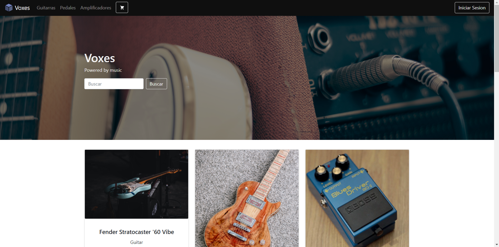
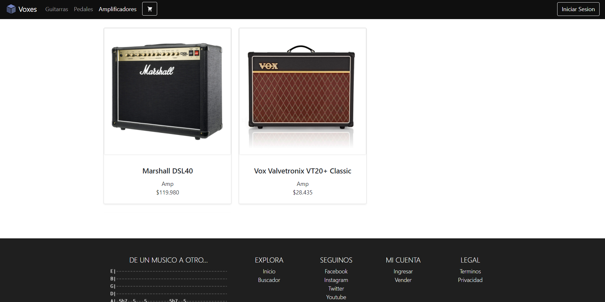
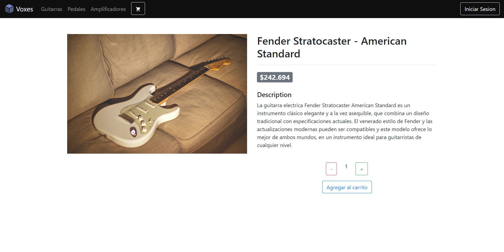
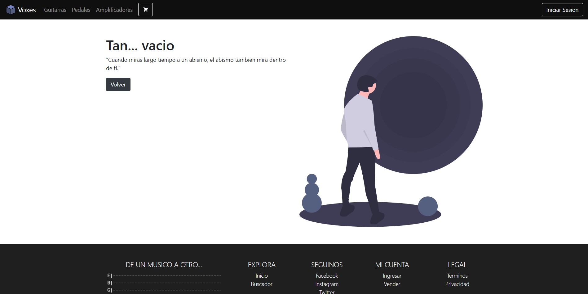

# Voxes
Voxes. Un sitio E-Commerce donde se venden instrumentos musicales y accesorios. 

**Deploy**: https://voxes.netlify.app/ 

:black_nib: Hecho por Juan Cruz Gutierrez

## Estado del sitio

Este proyecto se encuentra actualmente en desarrollo.

Actualmente el sitio presenta las siguientes caracteristicas:

  - Muestra de todos los productos publicados en la pantalla de inicio
  - Navegacion de productos por categoria
  - Seleccion de un producto para ver detalles extras del mismo
      - Permite elegir una cantidad de un stock disponible y agregarla al carrito 
      
## Capturas de pantalla

## Pre-requisitos, Instalacion y Configuracion

Vamos a hacer uso de `node` y `npm`, por lo que deberas tenerlos instalados en tu maquina.

En primer lugar, hay que clonar el repositorio. 
#### `git clone https://github.com/gutierrezS98/Coderhouse_React.git`

Instalacion: 
#### `npm install`

Para correr la aplicacion:
#### `npm start`

Para ver en el navegador:
#### `localhost:3000`

## Herramientas usadas

  - ReactJs (v17.0.1)
  - React Bootstrap (v1.4.0)
  - React-Icons (v4.1.0)
  - React Router Dom (v5.2.0)
  
